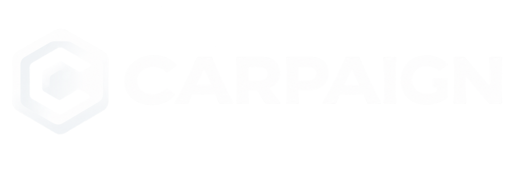
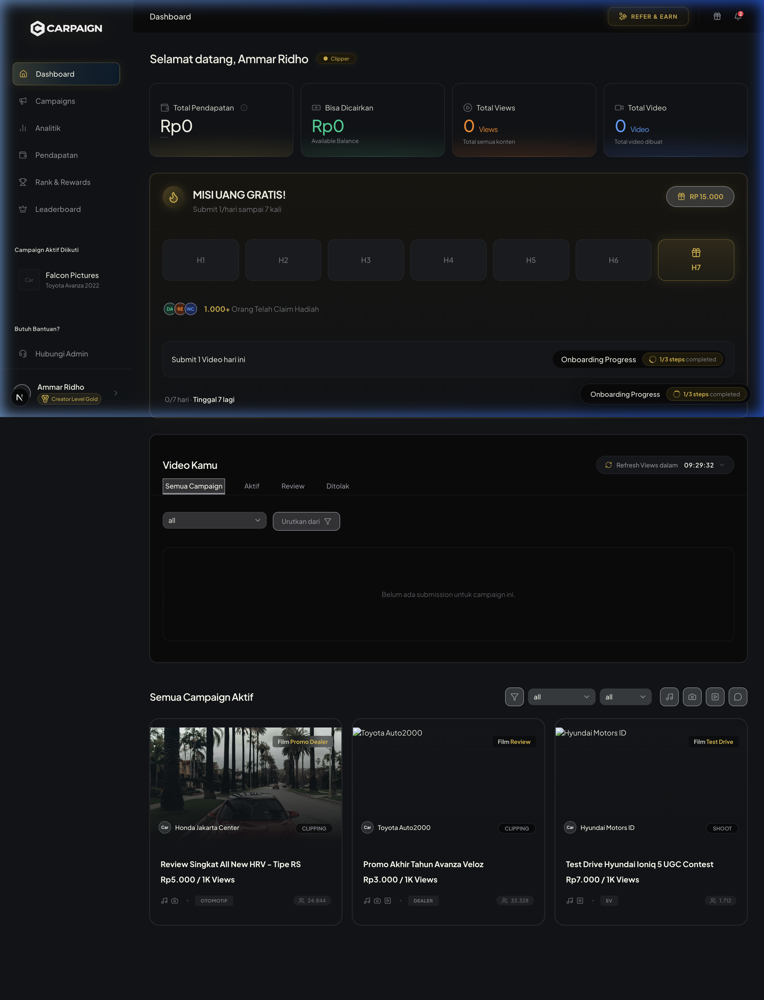

<div align="center">
  
  <br />
  <p><strong>Turn Vehicle Inventory Into Content</strong></p>
</div>

---

## 📌 Apa itu Carpaign?
Carpaign adalah platform inovatif yang menghubungkan Dealer Otomotif/Brand dengan Kreator Konten. Kreator dapat memilih "Campaign" (seperti Edit, Shoot, Publish, UGC) dari inventory kendaraan yang tersedia dan mendapatkan cuan dari hasil kerja mereka. Platform ini mengusung antarmuka bergaya *Luxury Gold & Tech* yang premium.

## 🚀 Fitur Utama
- **Creator Dashboard**: Ringkasan performa kreator, metrik *views*, dan status kampanye berjalan.
- **Campaign Marketplace**: Menelusuri kampanye aktif (Edit, Shoot, UGC, Publish) untuk diambil dan dikerjakan.
- **Dynamic Routing**: Halaman detail kampanye yang memuat instruksi, deadline, dan kriteria konten.
- **Leaderboard & Rank System**: Sistem kompetisi kreator berdasarkan view dengan sistem *tier* (Rank).
- **Pendapatan & Analitik**: Laporan analitik mendalam dan riwayat pendapatan (withdrawal).

## 📸 Demo Dashboard


## 🛠 Tech Stack
Proyek ini dibangun di atas teknologi frontend modern:
- **[Next.js 15 (App Router)](https://nextjs.org/)**: Framework React untuk rendering (SSR/SSG), optimasi performa, dan routing dinamis.
- **[React 19](https://react.dev/)**: Library UI dengan fitur-fitur Server Components.
- **[Tailwind CSS v4](https://tailwindcss.com/)**: Utility-first CSS framework untuk *styling* super cepat dengan *custom theme* (Luxury Gold).
- **[shadcn/ui](https://ui.shadcn.com/)**: Koleksi komponen UI *accessible* yang dapat disesuaikan (Radix UI).
- **[Framer Motion](https://www.framer.com/motion/)**: Animasi *scroll*, transisi halus, dan interaksi dinamis.
- **[Lucide React](https://lucide.dev/)**: Ikon SVG minimalis nan elegan.

## 💻 Cara Menjalankan Proyek (Local Development)

Ikuti langkah-langkah di bawah ini untuk menjalankan Carpaign di mesin lokal Anda:

1. **Clone repository ini:**
   ```bash
   git clone https://github.com/USERNAME/carpaign.git
   cd carpaign
   ```

2. **Install dependensi:**
   ```bash
   npm install
   # atau
   yarn install
   # atau
   pnpm install
   ```

3. **Jalankan server *development*:**
   ```bash
   npm run dev
   ```

4. Buka [http://localhost:3000](http://localhost:3000) di browser Anda untuk melihat hasilnya. Halaman utama secara otomatis akan *redirect* ke `/dashboard`.

## 📁 Struktur Direktori
- `src/app/`: Berisi semua *route* halaman (Dashboard, Campaigns, Leaderboard, dll).
- `src/components/views/`: Berisi komponen utama *view* spesifik (layar penuh) untuk masing-masing halaman.
- `src/components/ui/`: Komponen UI modular (Buttons, Cards, Dialogs) bawaan *shadcn*.
- `src/components/layout/`: Komponen tata letak utama (Sidebar, Header, DashboardLayout).
- `src/components/modals/`: Komponen interaktif *pop-up* (Invite Modal, dll).
- `public/`: Aset statis seperti *image* (Logo, Ikon) yang disajikan langsung.
